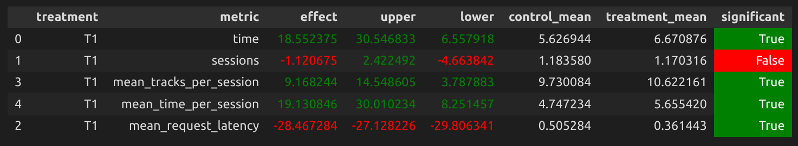

# ДЗ
## Отчет по улучшению сервиса рекомендаций botify

### Abstract
Основная идея улучшений заключается в том, чтобы построить гибридную рекомендательную систему, основываясь на предполагаемой логике пользователя.  
Предположим, что изначально пользователь выбрал инересующий его трек. Тогда на первых этапах целесообразно предлагать ему треки, которые он потенциально хотел бы прослушать после выбранного. Например, у него было грустное настроение, первый трек был тоже грусный, соответсвенно и рекомендовать мы ему должны грустные треки. Когда такие треки ему надоели, мы можем попробовать предложить прослушать треки из его персональных рекомендаций. Они для пользователя являются ультимативным вариантом на случай, когда ему перестали "заходить" треки, похожие на его первый выбранный. Ну и под конец, когда пользователь и от своих персональных рекомендаций устал, мы пытаемся втянуть его самыми популярными треками, которые всяко будут лучше рандома.

### Детали
За основу был взят Contextual рекомендер. Однако, fallback для него - немного переработанный (об этом позднее) Indexed рекомендер. Во первых, был взят threshold для prev_track_time равный 0.7. Если пользователь на "вайбе" первого трека, то он, скорее всего, будет слушать похожие треки достаточно долго (больше 70%). Однако, если этот "вайб" начал исчезать, то мы предлагаем ему треки из его персональных рекомендаций. Также стоит учесть, что было сокращено количество рекомендаций для трека (из 'tracks_with_recs.json') со 100 до 20 соседей. Таким образом, мы оставили более подходящие треки в "вайбе" первого трека, хоть их разнообразие и уменьшилось (для нашей логики это не существенно, т к основая часть рекомендаций придется на Indexed рекомендер). Другими словами, мы увеличили плотность "вайба", если так можно выразиться:)
По поводу Indexed, fallback для него был заменен с Random на TopPop, т к топ явно лучше, чем рандом. Ну и в случае, если пользователь устанет от собственного вкуса (threshold для prev_track_time равен 0.15), то пускай посмотрит, что нынче народ случает, может ему что и понравится.

### Результаты A/B эксперимента
Как итог - наши рекомендации стали лучше почти на 20%.

Результат воспроизводимый, актуальный A/B тест проанализирован в Week1Seminar.ipynb.